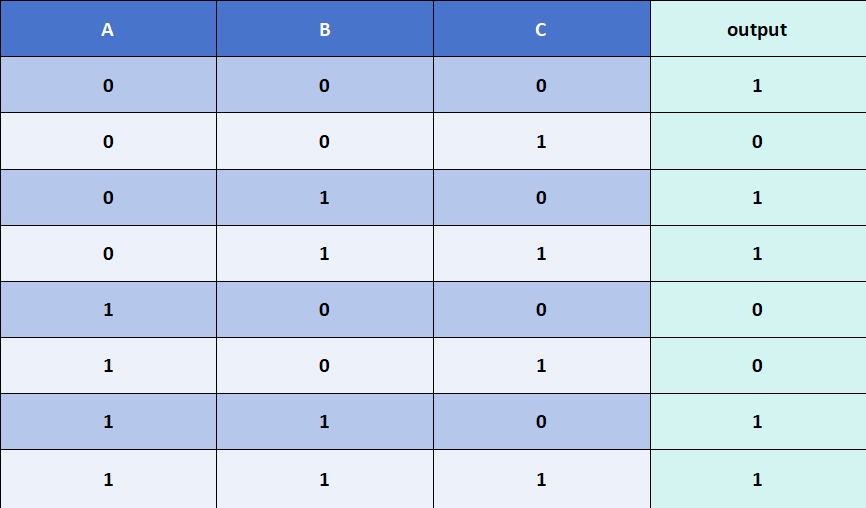
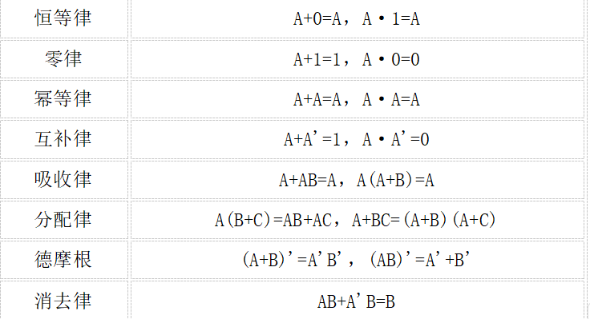
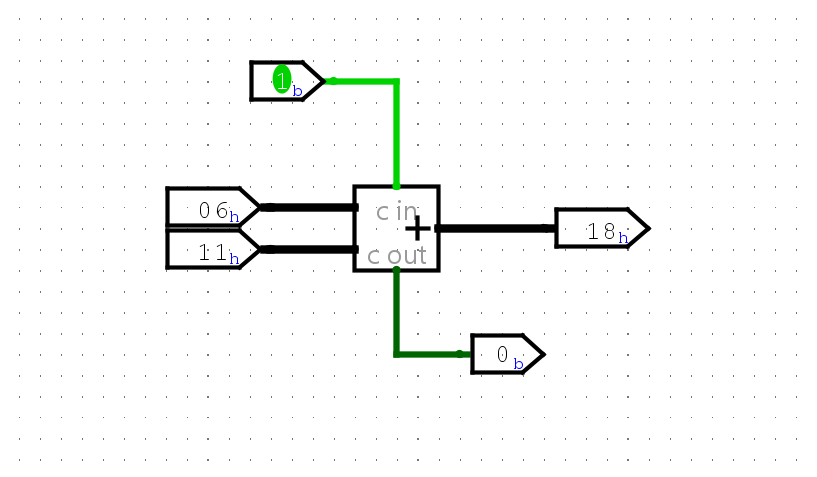

# F阶段 部分基础知识扩展
正式进入本扩展讲义之前，先明确： 本扩展旨在补充一些讲义中涉及但不够仔细描述的知识，就算不参考本扩展讲义，你仍然能很好的完成F的必做题，讲义的存在是为了让你更好地理解相关知识，但并不意味着你就能心安理得的将学习完全交给讲义，有些不清楚的知识还是建议你通过 **STFW** 来获得，这也是我们希望你能学到的最重要的技能.
 
## F3
###  真值表的转化
在F3讲义“搭建异或门”必做题中，简单提到了如何通过真值表转换为逻辑表达式的方法，理论上说只要你能写出真值表，那这个方法就能让你解决所有的电路搭建了，这里我们展开来细说一下，查看下图的真值表：

 

  

 

我们重新描述讲义中的方法：1、找到所有输出为“1”的情况，再根据输入情况，输入“1”则不变，输入“0”则取反，将输入取与，以第一行为例就是 ~A & ~B & ~C. 2、将所有这些情况取或,得到上述真值表的完整表达式:

 

Y = (~A & ~B & ~C) | (~A & B & ~C) | (~A & B & C) | (A & B & ~C) | (A & B & C)

 

事实上,你不止可以通过找"1"的情况来解决,还可以通过找"0"的情况来解决: 1、根据输入情况,“0”则不变，输入“1”则取反，将输入取或,以第二行为例就是 A | B | ~C. 2、将所有这些情况取与,得到真值表的完整表达式:

 

Y = (A | B | ~C) & (~A | B | C) & (~A | B | ~C)

 

试着检查下两个表达式是不是都能代表上述真值表,而且第二个表达式看起来是不是要简洁很多?这是因为这里输出0的情况更少,真实搭建电路时你就可以根据输出的情况来找出逻辑表达式了,总结就是 **"1多找0,0多找1"** . 
接下来相信你已经会举一反三了,哪怕4个、5个甚至更多输入你都能写出最基础的逻辑表达式,并根据表达式搭建出相应电路,多个输出也一样,因为每个输出都可以看成独立的一个真值表.现在回去看 **七段数码管** 的搭建,是不是有思路了呢?当然，讲义中的一些电路搭建也不一定要用这种“万能公式”来解决，毕竟logisim提供了不少元件供你使用，该怎么搭配它们来实现电路功能，相信聪明的你肯定能做到.

    有关卡诺图化简的知识就请你STFW了,不了解它不影响你F阶段电路的搭建,但是数字逻辑的课程你迟早会学到的.

###  一些布尔计算
以下公式作为电路化简的参考，其中加法“+”表示逻辑取或，乘法“·”表示逻辑取与，单引号“ ’ ”表示逻辑取非.

 

  

 

实际上在F阶段的学习中完全不需要这些公式，但是如果你很喜欢简洁的电路，那你可以尝试是否能用这些公式将你的电路化简，而现在你可以尝试利用这些公式验证上面的两个真值表逻辑表达式是否是同一个表达式.
## F5
### 良好的模块化设计
进入F5和F6，必做题就不仅仅要求你搭建单一的数字电路元件了，而是要求你组合成一个庞大的简易处理器，这就使得你的线路搭建思路变得重要，毕竟那么多条线路，不说搭建的时候异常痛苦，隔段时间回来看你就已经不记得某一根信号线的作用了。回想在C/C++中的函数设计，函数的特点就是只管外部调用，不管内部实现，举个栗子，函数 **int add(int a, int b)** ,作为调用方，我们只需要保证传入参数都是int类型，并且承接出加法计算结果，至于函数内部怎么实现我们无需关心，因此我们的代码就变成了简洁的“函数调用+参数传递”：传入参数，返回结果，这个结果又可以作为参数传入下一个函数，而且各个函数相互独立，互不干扰。回到logisim，尝试看看软件自带的加法器元件，你会发现它和上述的add函数极其相似，只要你正确连接a、b和cin，承接sum和cout即可，里面究竟怎么实现的你在调用时无需关心，不过在接下来的设计里，由于你自己就是模块实现者，所以还是请你关心一下.

 

  

 

类似于代码，你的电路就可以是简洁的“模块实例化+信号连接”了！每个实例化出来的模块只需要少数信号线连接————因为你设计的模块不大可能会有十几个接口，这样你的电路就能够看起来清晰明了。当然，这里存在两个问题：1、怎么实现那些模块？2、模块之间应该怎么连接？还是拿C/C++为例子，这两个问题就是怎么设计函数、怎么调用函数？事实上这两个问题就是你该去思考并解决的，第一个问题，看回F5讲义，要求实现**取指**功能，那你就可以把它装进一个模块里，在里面实现取指功能，具体的，可以看作输入PC，得到指令inst，至于怎么做到就需要你开动脑筋了。第二个问题其实更简单，因为你只需要考虑每个模块信号间的关系，讲义里也很明确指出了各个步骤是顺序执行的，按照你的理解联系好各个模块即可，当然有些时候信号连接不是单一的，即单纯的a->b，有时候可能也需要多个信号逻辑处理后再传输，比如需要取与、取反等.

 
完成好第一个<b>li</b>指令后你的“模块实例化+信号连接”就已经初具雏形了，尽管可能不完美，但是这是你养成模块化思维的关键一步，接下来完整的指令实现就简单许多了，具体的就是在各个模块内部添加功能，修改最外层的连接信号线，如果你的设计足够顶级，你甚至只需要更改每个模块内部的电路，完全不需要更改最外层每个模块的信号连接！还是拿取指模块为例，输入PC得到inst，你要做的不就是添加更多指令序列而已嘛，接口完全不用动。

 

    这里省去了很多细节，你可以去思考：为什么要按讲义上的步骤划分，能否有其它的功能划分？实现模块内功能的时候是先设计外部接口还是先设计内部实现？实现某个模块功能的时候要不要考虑其它模块是否能方便地承接信号？电路出了bug应该看模块还是看信号连接？最顶层什么细节都看不到，这样难道不是更加麻烦？哪怕你没有使用这种模块化思想你也可以解决电路搭建，但是这里是为了让你更早的明白模块化设计是怎么样的，哪怕你不搭电路，写代码你也总会遇到封装思想，相信我，以后你还会很多次遇到这样的思想.

### 电路震荡
未完成

## F6
### 未完成