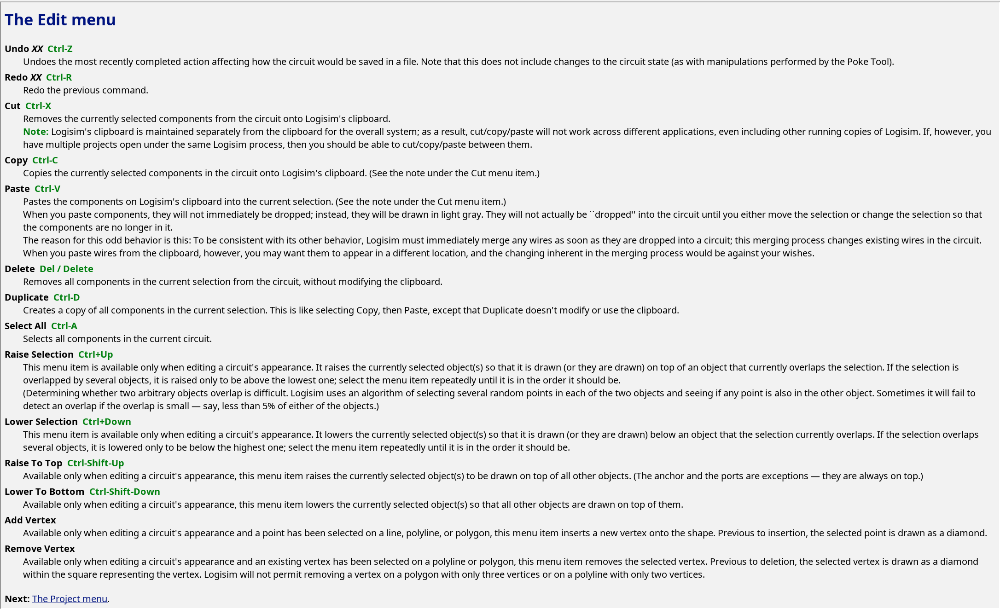
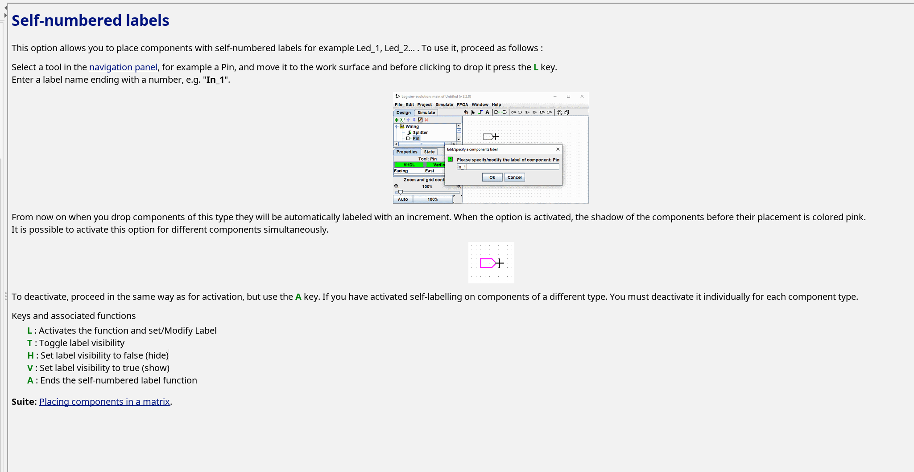
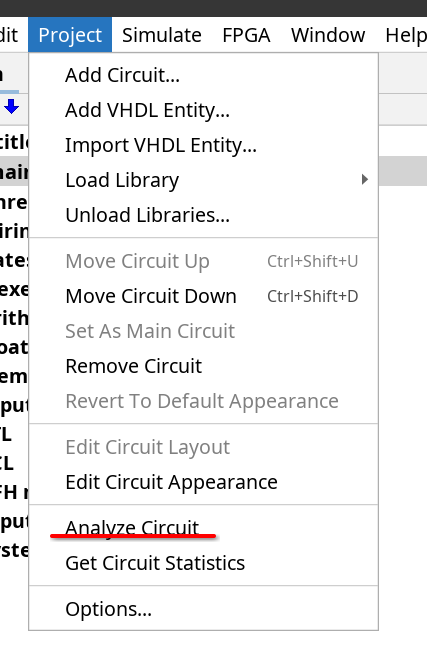
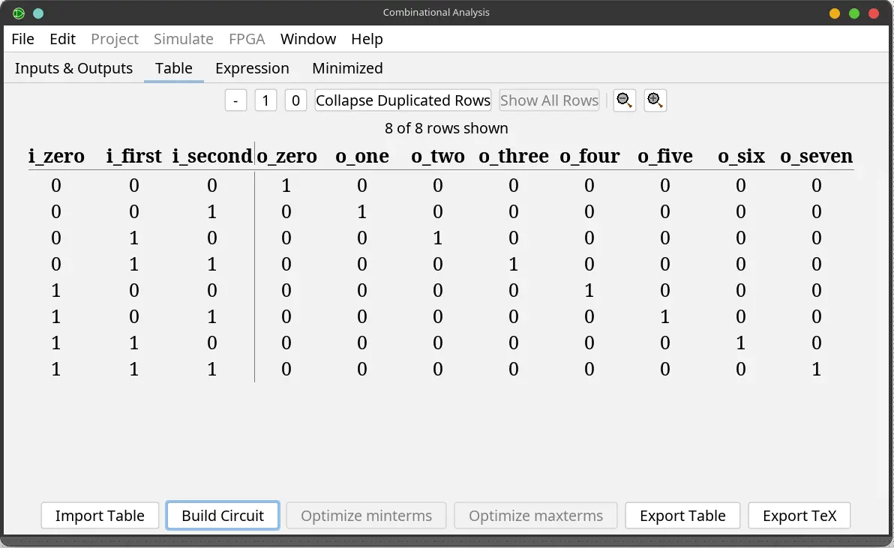
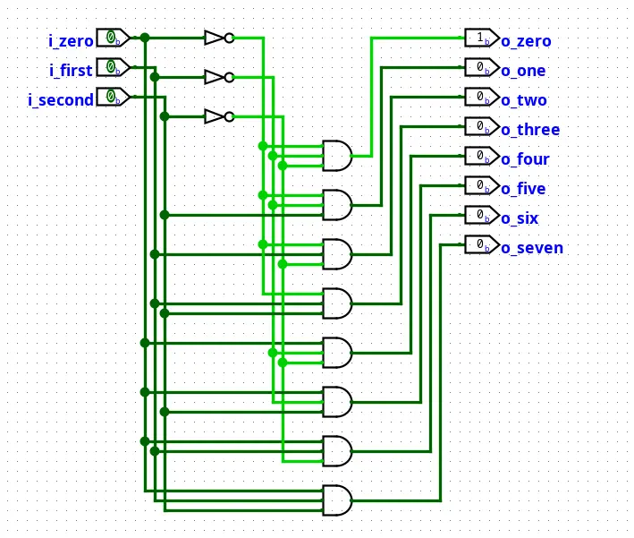

# 优雅地使用Logisim

> Work smarter, not harder.

在F阶段，`Logisim`将会是我们最常用的工具，你需要在上面完成各种电路的搭建，完成许多的测试。
但相信你在搭建了几个电路就不难发现：用鼠标一个一个地把逻辑门拖下来，也太麻烦了吧！

事实上，正如开头所说，我们的在使用工具时，不应陷入繁琐的操作中，而是要学会如何优雅地使用工具，提升我们的效率。
而`Logisim`的确提供了许多功能，能让我们更优雅、更高效搭电路。他们就像一个个宝藏，藏在手册文档中。本文会带着大家从`Logisim`的手册，文档中了解部分常用功能，剩余就靠大家RTFM探索了。

## Shortcuts（快捷键）

 

  

 

通过上图可以看到，`Logisim`提供了许多快捷键（事实上不止这个menu提供了快捷键）。在这些快捷键中，例如常用的有`Ctrl-D`复制选中的元件，`Ctrl-T`拨动时钟向前走半个周期，光是这两个简单的快捷键，
就已经可以让你在搭建电路时免去不少拖鼠标按按钮的功夫了。

## Self-numbered Labels（自编号标签）

你也许会遇到这样的情况：你在搭建一个3-8译码器，你想给每一位的输出都加上一个标签，但很快你就意识到：如果全部打上标签，就要写8次几乎完全一样的标签，这也太麻烦了吧！
虽然你这次尝试依靠自己顽强的意志，耐着性子写完了8个“output_X”标签，但很快，在你搭4-16译码器的时候，你终于意识到了这个工作的繁琐重复程度之高。

永远要记住：**我们不应该做重复的工作**，而是要学会如何利用工具来帮我们完成这些重复的工作。事实上，最擅长做这种重复工作的就是计算机。到后期，我们不仅会使用工具，
我们还需要自己编写工具，但这是后话了，目前我们只需要关注如何使用好`Logisim`为我们提供的工具就可以了。

`Logisim`针对标签提供了一个非常好用的功能：**自编号标签（Self-numbered Labels）**，它可以让你在搭建电路时，快速地为一组标签自动编号，省去你重复输入的麻烦。

  

    self-numbered labels使用演示

 

  

 

图中所示的文档对self-numbered labesl的使用作了详细地讲解，我就不重复文档的内容了，详细的内容可以自行打开`Logisim`的文档查询。

> [!TIP]
> **User Guide里的文档好多，我好像找不到这篇文档**

试试文档的搜索功能

## Generate a Circuit（生成电路）

我们都知道，一个组合逻辑电路可以由以下三种方式来描述：

- logic circuits（逻辑电路图）
- Boolean expressions（布尔表达式）, which allow an algebraic representation of how the circuit works
- truth tables（真值表）, which list all possible input combinations and the corresponding outputs

`Logisim`的Combinational Analysis功能支持我们将逻辑电路图、布尔表达式、真值表三者之间进行转换。这里主要讲解比较常见的使用方式，即利用真值表生成逻辑电路图。

  

点击`Analyze Circuit`后，我们便可设定输入输出的数量及名称，然后通过真值表或布尔表达式生成逻辑电路图。

  

之后点击`Build Circuit`，便可生成逻辑电路图。

  

## 更多功能

以上介绍的只是`Logisim`的部分常用功能，`Logisim`还提供了其他好用的功能或辅助元件，如插入探针以观察电路状态，增加隧道以减少连线的混乱，使用`subcircuit`以便于管理复杂电路……

更多的功能就请大家RTFM了，`Logisim`的文档较少、而且内容简单，是大家RTFM不错的起点。
